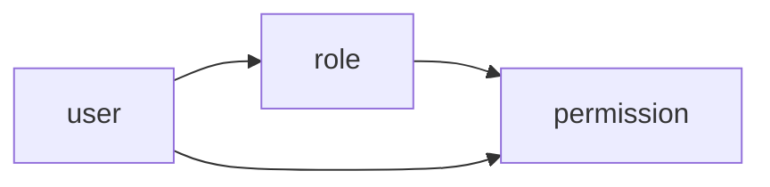

# 权限v2总览

## 模式


```sh

--------------------------------------------
|                                          |
|             |--------|                   |
|  user  -->  |  role  |  -->              |
|    \        |--------|                   |
|     \                        permission  |
|      \ ------------------->              |
|                                          |
--------------------------------------------
```




- 严格的上下级权限，只有上级可以管理下级，可以越级
- 超级管理员(super/root)同样是一个角色，一个凌驾于所有的角色
- 当一个用户被创建时，默认拥有`guest(游客)`角色，该角色拥有基本的访问和登陆
- role(角色)是权限的集合，是一个抽象的概念
- `role`有层级(level)之分，上级角色若拥有管理权限，可以管理下级的角色，否则只是结构的上、下级
- 操作权包括：下级角色创建权(create)、下级角色更新权(update)、下级角色删除权(delete)、权限分配权(grant)，权限回收权(recycle)。
- 用户在分配，回收权限的时候只能以自己的权限为基础，如果自己都没有的权限不能分配给下级和同级，不能回收自己都没有的权限
- 上级拥有下级的绝对管理权，下级不能管理上级；即使下级角色拥有了角色删除权，但是受层级限制，他也只能删除他的下级角色
- 层级结构跟unix文件树结构一样，已 /root 为跟节点依次向下延生。

## 数据库设计

见`schema.sql`

## 具体细节

权限被授予后，还需要受限于层级结构

- 权限还是分为开发层面和支配权限，只有接口实现了权限，才可能支配
- 新建角色，新建用户，删除角色，删除用户（下级不可删除上级）
- 访问权限与以前一样


## 操作

### 基本授权方式

- 给角色授权： 新建角色 -> 给角色授权 -> 拉用户进入角色 -> 用户自动拥有角色权限
- 给用户授权： 新建用户 -> 直接给用户授权 -> 用户拥有了权限

### 查询用户权限

- 先查询角色
- 再单独查询角色权限


## 思考？？？

如果用户已有的角色拥有了某权限，再将该权限分配给用户时，拒绝？
如果用户已经拥有了权限，分配用户角色时，如果该角色已经有了该权限，合并？OR 并有？
